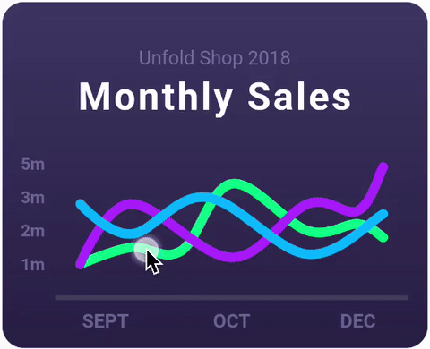
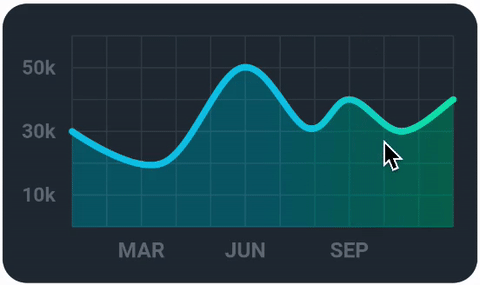
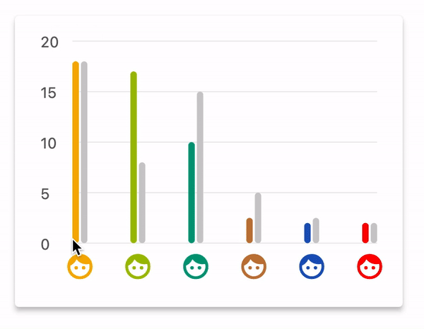
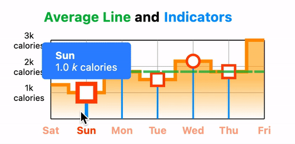

# Backtest-X - Trading Backtest Application

Full-featured trading backtest application for retail traders built with Flutter & Stacked architecture.

## 🚀 Quick Start

### Prerequisites

```bash
Flutter SDK >= 3.0.0
Dart SDK >= 3.0.0
```

### Installation

1. **Clone & Install Dependencies**

```bash
flutter pub get
```

2. **Generate Code** (Stacked, Freezed, JSON)

```bash
flutter pub run build_runner build --delete-conflicting-outputs
```

3. **Run the App**

```bash
flutter run
```

## 🔐 Authentication Setup (Supabase)

- Set `Site URL` sesuai origin aplikasi (dev/prod). Contoh dev: `http://localhost:8081/`.
- Tambahkan `Redirect URLs` untuk OAuth Google dan email confirmation:
  - Web (dev): `http://localhost:8081/`
  - Web (prod): `https://yourdomain.com/`
  - Mobile: `io.supabase.flutter://login-callback` (Android intent filter, iOS CFBundleURLSchemes)
- Jalankan web dev server dengan port stabil agar link email tetap valid di sesi berbeda:

```bash
flutter run -d web-server \
  --web-hostname localhost \
  --web-port 8081 \
  --dart-define SUPABASE_URL=<your_supabase_url> \
  --dart-define SUPABASE_ANON_KEY=<your_anon_key>
```

Alternatif (Makefile):

```bash
make run-web URL=<your_supabase_url> KEY=<your_anon_key>
```

## 📱 Platform Setup Guide

### Web Setup

1. **Development Setup**

```bash
# Jalankan web server dengan port tetap
flutter run -d web-server \
  --web-hostname localhost \
  --web-port 8081 \
  --dart-define=SUPABASE_URL=<your_supabase_url> \
  --dart-define=SUPABASE_ANON_KEY=<your_anon_key>

# Atau gunakan Makefile
make run-web URL=<your_supabase_url> KEY=<your_anon_key>
```

2. **Production Build**

```bash
# Build untuk production
flutter build web \
  --release \
  --dart-define=SUPABASE_URL=<your_supabase_url> \
  --dart-define=SUPABASE_ANON_KEY=<your_anon_key>

# Deploy ke hosting (contoh Firebase)
firebase deploy --only hosting
```

3. **Web-Specific Configuration**

- Pastikan `index.html` memiliki meta tag yang sesuai:
```html
<meta name="google-signin-client_id" content="YOUR_GOOGLE_CLIENT_ID.apps.googleusercontent.com">
```
- Untuk PWA, pastikan `manifest.json` dan service worker sudah dikonfigurasi dengan benar
- Aktifkan CORS di Supabase untuk domain aplikasi web Anda

### Android Setup

1. **Konfigurasi Project**

- Buka `android/app/build.gradle.kts` dan pastikan:
  - `minSdkVersion` minimal 21
  - `compileSdkVersion` minimal 33
  - `targetSdkVersion` minimal 33

2. **Intent Filter untuk Deep Links**

Tambahkan kode berikut di `android/app/src/main/AndroidManifest.xml` dalam tag `<activity>`:

```xml
<!-- Deep Link Handler -->
<intent-filter>
    <action android:name="android.intent.action.VIEW" />
    <category android:name="android.intent.category.DEFAULT" />
    <category android:name="android.intent.category.BROWSABLE" />
    <!-- Supabase Auth Redirect -->
    <data android:scheme="io.supabase.flutter" android:host="login-callback" />
</intent-filter>
```

3. **Menjalankan di Device/Emulator**

```bash
# Lihat daftar device yang tersedia
flutter devices

# Jalankan di device Android
flutter run -d <android_device_id> \
  --dart-define=SUPABASE_URL=<your_supabase_url> \
  --dart-define=SUPABASE_ANON_KEY=<your_anon_key>
```

4. **Build APK/App Bundle**

```bash
# Build APK debug
flutter build apk --debug \
  --dart-define=SUPABASE_URL=<your_supabase_url> \
  --dart-define=SUPABASE_ANON_KEY=<your_anon_key>

# Build APK release
flutter build apk --release \
  --dart-define=SUPABASE_URL=<your_supabase_url> \
  --dart-define=SUPABASE_ANON_KEY=<your_anon_key>

# Build App Bundle untuk Play Store
flutter build appbundle \
  --dart-define=SUPABASE_URL=<your_supabase_url> \
  --dart-define=SUPABASE_ANON_KEY=<your_anon_key>
```

### iOS Setup

1. **Konfigurasi Project**

- Buka `ios/Runner.xcworkspace` dengan Xcode
- Pastikan iOS Deployment Target minimal 12.0
- Atur Bundle Identifier yang sesuai (mis. `com.yourcompany.backtestx`)
- Tambahkan team development Apple Anda

2. **URL Scheme untuk Deep Links**

- Di Xcode, pilih target Runner
- Buka tab "Info"
- Expand "URL Types"
- Tambahkan URL Type baru:
  - Identifier: `io.supabase.flutter`
  - URL Schemes: `io.supabase.flutter`
  - Role: Editor

3. **Associated Domains (Opsional untuk Universal Links)**

- Di tab "Signing & Capabilities", tambahkan "Associated Domains"
- Tambahkan: `applinks:yourdomain.com`

4. **Menjalankan di Simulator/Device**

```bash
# Lihat daftar device yang tersedia
flutter devices

# Jalankan di simulator iOS
flutter run -d <ios_simulator_id> \
  --dart-define=SUPABASE_URL=<your_supabase_url> \
  --dart-define=SUPABASE_ANON_KEY=<your_anon_key>
```

5. **Build IPA untuk TestFlight/App Store**

```bash
# Build untuk iOS
flutter build ios \
  --release \
  --dart-define=SUPABASE_URL=<your_supabase_url> \
  --dart-define=SUPABASE_ANON_KEY=<your_anon_key>
```

Kemudian buka `ios/Runner.xcworkspace` di Xcode untuk menyelesaikan proses archive dan upload ke App Store Connect.

### Environment Configuration & Fallback Mode

## 🌐 Localization

- See `docs/LOCALIZATION.md` for naming conventions, adding keys, and guard scripts.
- Manual `AppLocalizations` is the source of truth; ARB keys are snake_case, getters are camelCase.
- Run `dart run tool/check_arb_consistency.dart` to validate ARB consistency and unused keys.

Aplikasi memerlukan konfigurasi Supabase untuk autentikasi dan penyimpanan data:

- **Konfigurasi Normal**: Gunakan `--dart-define` untuk menyediakan kredensial Supabase:
  ```bash
  flutter run --dart-define=SUPABASE_URL=<your_supabase_url> --dart-define=SUPABASE_ANON_KEY=<your_anon_key>
  ```

- **Fallback Mode (Web Dev)**: Jika kredensial tidak dikonfigurasi saat menjalankan aplikasi web:
  - Banner peringatan akan muncul di StartupView
  - Operasi autentikasi diblokir dengan pesan error yang jelas
  - Tombol "Learn more" tersedia untuk membuka dokumentasi Supabase Flutter
  - Fitur ini membantu developer mengetahui bahwa kredensial belum dikonfigurasi

- **Produksi**: Pastikan selalu menyediakan kredensial yang valid untuk build produksi:
  ```bash
  flutter build web --dart-define=SUPABASE_URL=<your_supabase_url> --dart-define=SUPABASE_ANON_KEY=<your_anon_key>
  ```

Catatan:
- Kode menggunakan `Uri.base.origin` untuk `emailRedirectTo` saat signup/resend di Web, dan skema `io.supabase.flutter://login-callback` di mobile untuk OAuth, signup verification, serta reset password.
- Pastikan `SUPABASE_URL` dan `SUPABASE_ANON_KEY` terpasang saat run.
- Di iOS, `AppDelegate` telah meneruskan `openURL` ke Flutter sehingga plugin menerima callback.

- Kode menggunakan `Uri.base.origin` untuk `emailRedirectTo` saat signup/resend sehingga link verifikasi diarahkan ke origin yang sedang aktif.

## 📱 Key Features

- **Strategy Builder**: Create trading strategies with custom entry/exit rules
- **Strategy Builder Tour**: Tur progresif (notice sheets) untuk panduan cepat di Builder
- **Deep Link Onboarding**: Buka app dengan template + data contoh untuk eksplorasi
- **Backtest Engine**: Test strategies against historical data
- **Performance Analytics**: Comprehensive statistics and visualizations
- **Backtest Result Header**: Shows tested `Symbol · Timeframe • Date Range` at the top of the results view for quick context
- **RSI Divergence (Approx)**: Template and quick‑run demo available
- **Anchored VWAP (Pullback/Cross)**:
  - Template available using anchored VWAP
  - New: configurable Anchor Mode — `Start` (backtest begin) or `Date`
  - Anchor by Date resolves to the first candle whose timestamp ≥ selected date
  - Full MTF support in engine (precalc per timeframe with unique keys)
  - Strategy Builder UI adds Anchor Mode and Anchor Date controls
- **Multi-platform Support**: Works on Web, Android, iOS, and desktop platforms
- **Data Import/Export**: Import CSV data and export backtest results (CSV, PDF)
  - Export trades to CSV from Backtest Result view
  - Export comparison results to CSV from Compare Results view
  - Copy comparison summary to clipboard from Compare Results view
  - Copy backtest summary to clipboard from Backtest Result view
  - Copy trades CSV to clipboard from Workspace results
  - Copy backtest summary to clipboard from Workspace results
  - Export trades to CSV from Workspace results list
- **Realtime Progress Events**: Engine emits progress (%) and per‑TF stats during backtests; UI shows spinner and a live percent label on Quick Test/Run Batch.
- PDF report includes Strategy Details section and improved charts (grid, axis labels, date range)

  PDF Export enhancements:

  - Multi‑page PDF report (Charts + Indicator Panel)

  New:

  - **ATR‑Based Position Sizing**: Select `atrBased` risk type to size positions by ATR multiple.
  - **Dynamic ATR% Presets**: Percentile chips (P25/P50/P75/P90) for `ATR%` indicator, computed per rule timeframe and selected dataset.

### Deep Link (Web/Mobile)

Use `DeepLinkService` to generate shareable links to open results directly:

```dart
final deepLinkService = locator<DeepLinkService>();
final url = deepLinkService.buildBacktestResultLink(resultId: result.id);
// Include `url` in your share text or buttons
```

On Web, links use the current origin with hash/path routing (e.g. `https://example.com/#/backtest-result-view?id=abc123`).
On app startup, if a deep link to Backtest Result is detected, the app navigates directly to the view.

Deep link onboarding ke Strategy Builder:

- Sertakan parameter `template` dan opsional `dataId` pada URL untuk membuka Strategy Builder dengan template diterapkan dan data contoh terpilih.
- Contoh: `https://example.com/#/strategy-builder?template=vwap_pullback&dataId=eurusd_1h`.
- Saat startup, tautan onboarding akan menavigasi ke Strategy Builder dan otomatis menerapkan template serta memilih data.
- Pagination/layout optimized for long datasets
- Dynamic file naming `
<strategy>-<tf>-<date>.pdf` (sanitized)
- Unit tests cover naming & PDF generation
- **Share Results**: Share backtest results with others
- **Auto-save**: Strategy Builder auto-saves drafts to prevent data loss
- **Workspace Filters**: Filter results by Profit/PF/Win Rate, Symbol, Timeframe, and Date Range
- **Background Cache Warm-up**: Pause/enable toggle and manual "Load Now" on Home
- **Warm-up Indicator Banner**: "Loading cache…" visible during background loading
- **Cache Status Indicator (AppBar)**: Shows cache state — Ready (green), Warming (orange), or Empty (grey)
- **Quick Stats Skeletons**: Placeholder numbers on Home while data loads

## 🧭 Usage - Workspace Filters

Langkah menggunakan filter di `Workspace`:

- Buka view `Workspace` dari menu utama.
- Pada kartu strategi, scroll ke daftar `Results`.
- Gunakan `FilterChip` untuk performa: `Profit Only`, `PF > 1`, `Win Rate > 50%`.
- Pilih `Symbol` dan `Timeframe` lewat dropdown di atas daftar hasil.
- Atur `Start Date` dan `End Date` untuk membatasi hasil berdasarkan tanggal eksekusi.
- Klik `Clear Filters` untuk mengembalikan semua hasil.
- Daftar hasil akan otomatis terfilter sesuai pilihan.

Catatan:

- Opsi `Symbol/Timeframe` diambil dari data hasil yang tersimpan untuk strategi tersebut.
- Jika opsi kosong atau terbatas, jalankan backtest agar data tersedia.
- Tombol `Export CSV` di header daftar hasil mengekspor ringkasan sesuai hasil terfilter (termasuk tanggal).

Export CSV (filtered):

- Gunakan tombol `Export CSV` di header daftar hasil untuk mengekspor ringkasan hasil yang sedang terfilter.
- Atau, buka menu aksi (`⋮`) pada kartu strategi dan pilih `Export Results (CSV)` untuk hasil terfilter yang sama.
- File berisi kolom: `Strategy`, `Symbol`, `Timeframe`, `Executed At`, `Total Trades`, `Win Rate %`, `Profit Factor`, `Total PnL`, `Total PnL %`, `Max Drawdown`, `Max DD %`, `Sharpe`.
- Ekspor mengikuti semua filter aktif: performa, symbol, timeframe, dan rentang tanggal.

## ⚡ Quick Test & Batch (Workspace)

Gunakan aksi cepat di kartu strategi untuk menjalankan backtest tanpa meninggalkan Workspace:

- Pilih `market data` dari dropdown di area Quick Actions.
- Klik `Quick Test` untuk menjalankan satu backtest pada data terpilih.
- Klik `Run Batch` untuk menjalankan backtest berturut pada semua data yang tersedia. Setiap hasil disimpan otomatis ke database dan muncul di daftar hasil.
- Selama proses berjalan, tombol akan nonaktif dan menampilkan indikator progres (spinner) serta label progres live, mis. `Quick Test (37%)`, untuk mencegah aksi ganda.

## 🔧 Usage - Home Cache Warm-up

Kontrol pemuatan cache market data di Home:

- Buka menu `⋮` di `AppBar` Home.
- Pilih `Pause Background Warm-up` atau `Enable Background Warm-up` untuk menonaktifkan/menyalakan proses background.
- Klik `Load Cache Now` untuk memaksa pemuatan cache segera.
- Perhatikan ikon status cache di `AppBar`:
  - Hijau (`offline_pin`): cache siap (data tersedia)
  - Oranye (`downloading`): cache sedang dipanaskan di background
  - Abu‑abu (`cloud_off`): cache kosong (belum ada data)
- Saat proses berjalan, banner teks `Loading cache…` muncul di kiri bawah layar. Angka quick stats menampilkan skeleton sampai data siap.

Catatan:

- Proses warm-up ditahan bila toggle dimatikan, dan dilanjutkan kembali saat diaktifkan.
- Throttling & batching mengurangi spike I/O sehingga UI tetap responsif.

## 📊 Database Structure (Supabase)

Aplikasi menggunakan Supabase sebagai backend dengan struktur tabel berikut:

### Tabel `profiles`

Menyimpan data profil pengguna yang terhubung dengan `auth.users`.

| Kolom | Tipe | Deskripsi |
|-------|------|-----------|
| id | UUID | Primary key, referensi ke auth.users(id) |
| email | TEXT | Email pengguna |
| full_name | TEXT | Nama lengkap (opsional) |
| avatar_url | TEXT | URL avatar (opsional) |
| subscription_tier | TEXT | Tier langganan ('free', 'premium', dll) |
| preferences | JSONB | Preferensi pengguna (tema, bahasa, dll) |
| created_at | TIMESTAMP | Waktu pembuatan |
| updated_at | TIMESTAMP | Waktu pembaruan terakhir |

### Tabel `strategies`

Menyimpan strategi trading yang dibuat pengguna.

| Kolom | Tipe | Deskripsi |
|-------|------|-----------|
| id | UUID | Primary key |
| user_id | UUID | Foreign key ke profiles(id) |
| name | TEXT | Nama strategi |
| description | TEXT | Deskripsi strategi |
| initial_capital | DECIMAL | Modal awal |
| risk_type | TEXT | Tipe manajemen risiko ('fixedLot', 'percentageRisk', 'atrBased') |
| risk_value | DECIMAL | Nilai risiko (lot tetap atau persentase) |
| stop_loss | DECIMAL | Stop loss dalam pips/poin atau % |
| take_profit | DECIMAL | Take profit dalam pips/poin atau % |
| use_trailing_stop | BOOLEAN | Apakah menggunakan trailing stop |
| trailing_stop_distance | DECIMAL | Jarak trailing stop |
| entry_rules | JSONB | Aturan masuk pasar (array) |
| exit_rules | JSONB | Aturan keluar pasar (array) |
| is_template | BOOLEAN | Apakah strategi adalah template |
| is_favorite | BOOLEAN | Apakah strategi difavoritkan |
| is_public | BOOLEAN | Apakah strategi publik |
| tags | TEXT[] | Tag untuk kategorisasi |
| created_at | TIMESTAMP | Waktu pembuatan |
| updated_at | TIMESTAMP | Waktu pembaruan terakhir |

### Tabel `results`

Menyimpan hasil backtest dari strategi.

| Kolom | Tipe | Deskripsi |
|-------|------|-----------|
| id | UUID | Primary key |
| user_id | UUID | Foreign key ke profiles(id) |
| strategy_id | UUID | Foreign key ke strategies(id) |
| symbol | TEXT | Simbol/instrumen yang diuji |
| timeframe | TEXT | Timeframe yang digunakan |
| start_date | TIMESTAMP | Tanggal mulai backtest |
| end_date | TIMESTAMP | Tanggal akhir backtest |
| initial_capital | DECIMAL | Modal awal |
| final_capital | DECIMAL | Modal akhir |
| total_profit_loss | DECIMAL | Total profit/loss |
| profit_factor | DECIMAL | Faktor profit |
| win_rate | DECIMAL | Persentase kemenangan |
| total_trades | INTEGER | Total transaksi |
| winning_trades | INTEGER | Jumlah transaksi profit |
| losing_trades | INTEGER | Jumlah transaksi loss |
| max_drawdown | DECIMAL | Drawdown maksimum |
| max_drawdown_percentage | DECIMAL | Persentase drawdown maksimum |
| sharpe_ratio | DECIMAL | Rasio Sharpe |
| trades | JSONB | Detail transaksi (array) |
| equity_curve | JSONB | Data kurva ekuitas |
| monthly_returns | JSONB | Return bulanan |
| created_at | TIMESTAMP | Waktu pembuatan |

### Row Level Security (RLS)

Semua tabel dilindungi dengan Row Level Security untuk memastikan pengguna hanya dapat:

- Melihat dan mengedit data mereka sendiri
- Melihat strategi dan hasil publik dari pengguna lain
- Tidak dapat mengubah data milik pengguna lain

Trigger otomatis diimplementasikan untuk:
- Membuat profil saat pengguna baru mendaftar
- Memperbarui timestamp `updated_at` saat data diubah

### Throttling — Realtime UI

- Home: refresh quick stats di‑throttle agar tidak rebuild beruntun saat batch event (upload/simpan)
- Backtest Result: refresh di‑throttle per‑event untuk menghindari spam render saat cache/result update beruntun
- Comparison: memiliki throttle ringan untuk interaksi UI cepat

Catatan:

- `Run Batch` menggunakan seluruh koleksi data yang tersedia di aplikasi. Jika ingin membatasi jumlah, opsi batas maksimum akan ditambahkan kemudian (planned).
- Hasil batch langsung tersimpan dan akan ikut terfilter oleh pilihan aktif (Profit/PF/Win Rate, Symbol, Timeframe, Date Range) saat ditampilkan.

## 📁 Project Structure

```
lib/
├── app/
│   ├── app.dart                 # Stacked app config
│   ├── app.locator.dart         # DI (auto-generated)
│   └── app.router.dart          # Routes (auto-generated)
├── core/
│   ├── data_manager.dart
├── ui/
│   ├── views/
│   │   ├── home/
│   │   │   ├── home_view.dart
│   │   │   └── home_viewmodel.dart
│   │   ├── data_upload/
│   │   │   ├── data_upload_view.dart
│   │   │   └── data_upload_viewmodel.dart
│   │   ├── pattern_scanner/
│   │   │   ├── pattern_scanner_view.dart
│   │   │   └── pattern_scanner_viewmodel.dart
│   │   ├── strategy_builder/
│   │   │   ├── strategy_builder_view.dart
│   │   │   └── strategy_builder_viewmodel.dart
│   │   ├── market_analysis/
│   │   │   ├── market_analysis_view.dart
│   │   │   └── market_analysis_viewmodel.dart
│   │   ├── backtest_result/
│   │   │   ├── backtest_result_view.dart
│   │   │   └── backtest_result_viewmodel.dart
│   │   ├── startup/
│   │   │   ├── startup_view.dart
│   │   │   └── startup_viewmodel.dart
│   │   └── workspace/
│   │       ├── workspace_view.dart
│   │       └── workspace_viewmodel.dart
│   └── widgets/
│       ├── candlestick_chart/
|       |   └── candlestick_chart.dart
│       ├── indicator_panel/
│       │   └── indicator_panel.dart
│       └── equity_curve/
│           └── equity_curve.dart
├── services/
│   ├── data_parser_service.dart
│   ├── backtest_engine_service.dart
|   |── data_validation_service.dart
│   ├── indicator_service.dart
│   └── storage_service.dart
├── models/
│   ├── candle.dart              # Freezed model
│   ├── strategy.dart            # Freezed model
│   └── trade.dart               # Freezed model
├── helpers/
│   ├── backtest_helper.dart
│   ├── comparison_helper.dart
│   └── strategy_stats_helper.dart
└── main.dart
```

## 📦 Dependencies

Key packages used in this project:

```yaml
dependencies:
  flutter:
    sdk: flutter
  stacked: ^3.4.0
  stacked_services: ^1.1.0

  # Data & Storage
  sqflite: ^2.3.0
  path_provider: ^2.1.1
  csv: ^6.0.0
  share_plus: ^7.2.1
  universal_html: ^2.2.4

  # Charts
  fl_chart: ^0.65.0
  candlesticks: ^2.1.0

  # Utils
  intl: ^0.18.0
  freezed_annotation: ^2.4.1
  json_annotation: ^4.8.1
  uuid: ^4.2.1

  # Export (PDF)
  pdf: ^3.10.8
  printing: ^5.12.0
```

## 🏗️ Architecture

### Stacked MVVM Pattern

**View** → **ViewModel** → **Service** → **Model**

- **Views**: Pure UI, no business logic
- **ViewModels**: Handle UI state & user interactions
- **Services**: Business logic (backtest engine, indicators, storage)
- **Models**: Data structures with Freezed (immutable)

### Key Services

#### 1. DataParserService

- Parse CSV files (OHLCV format)
- Auto-detect headers
- Validate data integrity

#### 2. IndicatorService

- Technical indicators: SMA, EMA, RSI, ATR, MACD, Bollinger Bands
- Anchored VWAP enhancements:
  - Accepts anchor index and computes VWAP from anchor onward
  - Engine maps Anchor Date to index using first timestamp ≥ date
  - Null values before anchor; precise rolling accumulations from anchor

### Strategy Builder — Anchored VWAP Setup

- Pilih `Indicator: Anchored VWAP` pada rule.
- Isi `Main Period` (periode utama indikator bila diperlukan oleh template/varian).
- Set `Anchor Mode`: `Start` atau `Date`.
  - `Start`: anchor di awal dataset/backtest.
  - `Date`: isi `Anchor Date` dengan format `YYYY-MM-DD` atau ISO (`YYYY-MM-DDTHH:mm:ss`).
- `Anchor Date` akan dipetakan ke indeks candle pertama dengan timestamp ≥ tanggal tersebut.
- Aturan mendukung operator `>`/`<` dan `crossAbove`/`crossBelow` terhadap angka atau indikator lain.
- Reusable calculation methods
- Optimized for performance

New indicators & templates:

- Indicators: `VWAP` (rolling window), `StochasticK` and `StochasticD` (%K/%D with SMA smoothing)
- Templates:
  - `VWAP Pullback — Close CrossAbove VWAP(20)`
  - `Stochastic Cross — %K(14) crossAbove %D(3) + ADX(14) > 20`

### Quick Run Demo (GIF)

To include visual demos for Quick Run, place GIFs under `assets/images/` and they will be shown here:

- VWAP Pullback Quick Run:

  

- Stochastic K/D Quick Run:

  

- Bollinger Squeeze Quick Run:

  

- RSI Divergence (Approx) Quick Run:

  

Note: Ensure the GIF files exist at the specified paths; otherwise the images will not render. I can integrate the provided GIFs on request.

Example strategy definitions:

```dart
// VWAP Pullback
final vwapPullback = Strategy(
  id: 'example_vwap',
  name: 'VWAP Pullback — Close CrossAbove VWAP',
  initialCapital: 10000,
  riskManagement: const RiskManagement(
    riskType: RiskType.percentageRisk,
    riskValue: 2.0,
    stopLoss: 150,
    takeProfit: 300,
  ),
  entryRules: const [
    StrategyRule(
      indicator: IndicatorType.close,
      operator: ComparisonOperator.crossAbove,
      value: ConditionValue.indicator(type: IndicatorType.vwap, period: 20),
    ),
  ],
  exitRules: const [
    StrategyRule(
      indicator: IndicatorType.close,
      operator: ComparisonOperator.crossBelow,
      value: ConditionValue.indicator(type: IndicatorType.vwap, period: 20),
    ),
  ],
);

// Stochastic K/D Cross + ADX filter
final stochCross = Strategy(
  id: 'example_stoch',
  name: 'Stochastic Cross — K/D + ADX Filter',
  initialCapital: 10000,
  riskManagement: const RiskManagement(
    riskType: RiskType.percentageRisk,
    riskValue: 1.5,
    stopLoss: 120,
    takeProfit: 240,
  ),
  entryRules: const [
    StrategyRule(
      indicator: IndicatorType.adx,
      period: 14,
      operator: ComparisonOperator.greaterThan,
      value: ConditionValue.number(20),
      logicalOperator: LogicalOperator.and,
    ),
    StrategyRule(
      indicator: IndicatorType.stochasticK,
      period: 14,
      operator: ComparisonOperator.crossAbove,
      value: ConditionValue.indicator(type: IndicatorType.stochasticD, period: 14),
    ),
  ],
  exitRules: const [
    StrategyRule(
      indicator: IndicatorType.stochasticK,
      period: 14,
      operator: ComparisonOperator.crossBelow,
      value: ConditionValue.indicator(type: IndicatorType.stochasticD, period: 14),
    ),
  ],
);
```

Quick Run (Workspace):

- The Workspace includes quick-run helpers; new methods are available:
  - `WorkspaceViewModel.quickRunVwapPullback()`
  - `WorkspaceViewModel.quickRunStochasticKdCross()`
- Wire these to UI (AppBar or strategy card actions) as needed, or run via debug/dev buttons.

#### 3. BacktestEngineService

- Core backtest loop
- Entry/Exit condition evaluation
- Risk management (SL/TP)
- Performance statistics

#### 4. StorageService

- SQLite local storage
- Save/load strategies
- Store backtest results
- Market data management

## 📊 Data Format

### CSV Upload Format

```csv
Date,Open,High,Low,Close,Volume
2024-01-01 00:00:00,1.0500,1.0520,1.0495,1.0510,1000
2024-01-01 01:00:00,1.0510,1.0530,1.0505,1.0525,1200
```

**Requirements:**

- Date format: `YYYY-MM-DD HH:mm:ss` or any parseable format
- Columns: Date, Open, High, Low, Close, Volume (optional)
- Headers: Optional (auto-detected)

## 🔧 Adding New Features

## 🖼️ Golden Tests

Untuk menjaga golden tests stabil dan bebas hang:

- Jalankan semua golden dengan `GOLDEN_TEST`:
  - `flutter test test/golden --reporter=expanded --dart-define=GOLDEN_TEST=true`
- Update baseline golden setelah perubahan UI yang disengaja:
  - `flutter test test/golden --update-goldens --reporter=expanded --dart-define=GOLDEN_TEST=true`
- Alternatif via Makefile:
  - `make goldens`
  - `make goldens-update`

Penjelasan:
- Mode `GOLDEN_TEST` mem-bypass I/O disk di `DataManager` (skip `path_provider` dan read/write file) agar `pump` tidak hang.
- Golden tests memakai `TickerMode(enabled: false)` dan beberapa `pump` untuk memastikan layout settle.
- Lihat pratinjau diffs di folder `test/golden/failures/` bila ada perbedaan.

- 10k+ candles integration test (Web + Mobile) ensures large dataset stability.
- 50k candles isolate stress test validates background isolate scalability.
- 20k candles EMA crossover test broadens indicator coverage.
- 20k candles RSI threshold test expands indicator scenarios.
- 100k candles isolate stress test pushes scalability further.

Run individual tests:

```bash
flutter test test/performance/backtest_large_dataset_test.dart
flutter test test/performance/backtest_isolate_stress_test.dart
flutter test test/performance/backtest_ema_20k_test.dart
flutter test test/performance/backtest_rsi_20k_test.dart
flutter test test/performance/backtest_isolate_100k_stress_test.dart
```

Profile with DevTools (see COMMANDS.md for details):

```bash
# Web (profile mode)
flutter run -d chrome --profile --web-port 7357
# Desktop (macOS example)
flutter run -d macos --profile
```

Tips snapshot deterministik:

- Kunci viewport: set `SurfaceSize` dan `devicePixelRatio` ke nilai tetap.
- Hindari `pumpAndSettle`; gunakan beberapa `pump` pendek lalu `expectLater`.
- Matikan warm‑up background `DataManager` di test.
- Stub `StorageService` untuk mengontrol data yang ditampilkan.

Troubleshooting:

- `MissingPluginException(getApplicationDocumentsDirectory)`: gunakan helper `mockPathProviderForTests()` di setup test.
- `databaseFactory not initialized`: bila memakai `sqflite_common_ffi`, set `databaseFactory = databaseFactoryFfi;` di setup.
- Log bising: panggil `silenceInfoLogsForTests()` untuk menaikkan threshold logger ke `warning`.

### Create New View (Stacked CLI)

```bash
# Install Stacked CLI
dart pub global activate stacked_cli

# Create new view with ViewModel
stacked create view strategy_builder

# Create service
stacked create service export
```

## ⚙️ Performance Best Practices

Tips praktis untuk menjaga UI responsif dan performa stabil di seluruh platform.

- Charts

  - Downsample data: kurangi titik data (mis. setiap N bar) untuk kurva ekuitas dan candlestick saat dataset sangat besar.
  - Batasi rebuild: bungkus chart dengan `const`/`RepaintBoundary`, gunakan `Selector`/`ValueListenableBuilder` agar hanya bagian yang berubah yang dirender ulang.
  - Hindari operasi berat di build: precompute seri data di ViewModel/Service lalu kirim final list ke widget chart.
  - Animasi bijak: matikan animasi chart saat dataset besar atau sedang scroll untuk menghindari jank.
  - Ukuran tetap: beri `SizedBox` dengan dimensi tetap agar layout tidak trigger layouting berulang.

- Lists (hasil backtest, trades, datasets)

  - Gunakan `ListView.builder`/`SliverList` alih-alih `ListView(children: ...)` untuk daftar panjang.
  - Beri `itemExtent` atau `prototypeItem` ketika tinggi item seragam untuk mengurangi biaya layout.
  - Gunakan `const` constructors, `const Text`, dan hindari closure berat di `itemBuilder`.
  - Memoize data item: format angka/tanggal di ViewModel lalu gunakan langsung di widget item.
  - Pagination/virtualization: tampilkan batch (mis. 100–200 items) dan sediakan tombol “Load more” bila diperlukan.

- Isolates & Async

  - Jalankan komputasi berat (parsing CSV, backtesting, statistik) di isolate: gunakan `Isolate.run` (Dart 3) atau util khusus seperti `IsolateBacktest.run(...)` agar UI tidak blocking.
  - Hindari synchronous I/O di thread UI; gunakan API async (`await`) dan tampilkan indikator busy.
  - Batch & throttle: bagi pekerjaan besar jadi beberapa langkah agar konsumsi CPU/IO stabil.

- Caching & Data Management

  - Cache hasil yang sering dipakai (summary, seri chart) di memori via `DataManager`.
  - Warm-up background: muat cache secara bertahap dengan kontrol toggle (lihat Home) untuk pengalaman awal yang halus.
  - Hindari duplikasi parsing: simpan data terstruktur (model) setelah parsing dan referensikan kembali.

- UI Thread Hygiene

  - Minimalkan `setState`/`notifyListeners` beruntun; kumpulkan perubahan dan panggil sekali.
  - Gunakan `debounce` untuk input/filter agar tidak memicu render berulang.
  - Gunakan `SnackBar` custom via `stacked_services` untuk feedback ringan tanpa memblokir UI.

- DevTools & Profiling

  - Jalankan `flutter run --profile` untuk mengukur frame time, jank, dan memory.
  - Aktifkan Performance Overlay di DevTools untuk melihat frame build/raster.
  - Gunakan `dart:developer` `Timeline` events untuk menandai fase komputasi berat.
  - Catat metrik sederhana (durasi parsing/backtest) di log untuk pemantauan.

- Web Khusus
  - Hindari payload JS besar dan pertimbangkan split data (lazy-load) untuk dataset besar.
  - Gunakan `Blob` + download URL untuk ekspor CSV tanpa menyimpan ke IndexedDB.
  - Perhatikan batas memori browser; downsample seri sebelum dirender.

Contoh yang dipakai di proyek:

- `IsolateBacktest.run(...)` untuk menjalankan backtest tanpa memblok UI.
- Warm-up cache terkontrol di Home (toggle dan “Load Now”).
- Export dan copy summary/trades dilakukan async dan memberi feedback via snackbar.

### Deterministic Golden Tests

Untuk menjaga snapshot UI konsisten lintas mesin:

- Kunci viewport: set `SurfaceSize` dan `devicePixelRatio` ke nilai tetap (mis. `Size(393, 852)`, DPR `1.0`).
- Hindari `pumpAndSettle` yang rawan timeout; gunakan beberapa `pump` pendek lalu `expectLater(matchesGoldenFile(...))`.
- Matikan warm-up background di test: panggil `DataManager().setBackgroundWarmupEnabled(false)` sebelum memompa widget.
- Stub layanan: gunakan mock `StorageService` untuk mengontrol strategi, datasets, dan `latest BacktestResult`.
- Hindari operasi disk di lingkungan test (VM): jangan memanggil `DataManager.cacheData(...)` jika `path_provider` tidak tersedia.

Troubleshooting:

- `MissingPluginException(getApplicationDocumentsDirectory)`: terjadi di VM test saat `path_provider` tidak aktif. Solusi: abaikan bila tidak memblokir, atau mock/inisialisasi alternatif dan hindari operasi disk.
- `databaseFactory not initialized`: jika memakai `sqflite_common_ffi`, inisialisasi di setup test (`databaseFactory = databaseFactoryFfi;`).

### Manual Creation

1. **Create View & ViewModel**

```dart
// lib/ui/views/my_view/my_view.dart
class MyView extends StackedView<MyViewModel> {
  // Implementation
}

// lib/ui/views/my_view/my_viewmodel.dart
class MyViewModel extends BaseViewModel {
  // Logic here
}
```

2. **Register in app.dart**

```dart
@StackedApp(
  routes: [
    MaterialRoute(page: MyView),
  ],
  dependencies: [
    // Add services
  ],
)
class App {}
```

3. **Regenerate Code**

```bash
flutter pub run build_runner build --delete-conflicting-outputs
```

## 🧪 Testing

### Test Indicators

```dart
void main() {
  final indicatorService = IndicatorService();
  final candles = [...]; // Sample data

  final sma = indicatorService.calculateSMA(candles, 20);
  final rsi = indicatorService.calculateRSI(candles, 14);

  expect(sma.last, closeTo(1.0500, 0.0001));
}
```

### Test Backtest Engine

```dart
void main() {
  final engine = BacktestEngineService(IndicatorService());

  final result = await engine.runBacktest(
    marketData: sampleData,
    strategy: sampleStrategy,
  );

  expect(result.summary.winRate, greaterThan(50));
}
```

## 🎯 Development Roadmap

### Phase 1 - MVP (Current)

- [x] Project setup & architecture
- [x] Data parser service
- [x] Indicator service (SMA, EMA, RSI, ATR, MACD, BB)
- [x] Backtest engine core
- [x] Storage service (SQLite)
- [x] Home view
- [x] Data upload view
- [x] Strategy builder view (form-based)
- [x] Backtest result view
- [x] Workspace view
- [x] Market analysis view
- [x] Pattern scanner view
- [x] comparison view
- [x] Basic charts

### Phase 2 - Polish (Next 3 months)

- [x] Export results (CSV, PDF)
- [x] Save/load strategies
- [ ] Multi-timeframe analysis
- [ ] UI/UX improvements
- [x] Dark/Light theme toggle
- [x] Advanced charts (candlestick with indicators)

## ✅ Recent Progress

- Dark theme consistency pass across key screens:
  - Workspace view, Backtest Result view
  - Strategy Builder entry/exit rules
  - Candlestick chart labels and grid
  - Pattern Scanner candlestick guide sheet
  - Market Analysis indicator settings sheet
- Equity/Drawdown toggle UI refined (themed background + outline)
- Chart info panel and price labels made theme-aware
- Comparison View improvements:
  - Show human-readable strategy names in cards and table
  - Add "Copy Summary" menu to copy comparison stats to clipboard
  - Grouped TF chart CSV export order mirrors UI Sort/Agg selection
  - Persist Compare view Sort/Agg preferences across sessions
- Loading skeletons for smoother UX:
  - Workspace results list and quick actions show skeletons on busy
  - Backtest Result chart area uses AnimatedSwitcher to show skeleton while loading
  - Busy states wired so skeletons appear on initial load and async actions
- Chart performance optimization:
  - Downsample candles in Backtest Result when dataset is large (>1500 points)
  - Cuts render jank on Flutter Web with big OHLC series
- Storage performance:
  - Added SQLite index on `market_data.uploaded_at` for faster sorting
  - Existing indexes on strategies and backtest_results retained
- Backtest Result improvements:
  - Add "Copy Summary" button to copy backtest stats to clipboard
  - Per‑Timeframe Charts in Backtest Result:
    - Dropdown metric selector in TF Stats panel: `winRate`, `profitFactor`, `expectancy`, `rr`, `trades`, `signals`, `wins`, `avgWin`, `avgLoss`
    - Horizontal bar chart visualization without extra dependencies
    - Respects selected timeframe chips; updates in real time
    - Code refs:
      - `lib/ui/views/backtest_result/backtest_result_viewmodel.dart` → state `selectedTfChartMetric`, `availableTfChartMetrics`, helper `getTfMetricSeries()`
      - `lib/ui/views/backtest_result/backtest_result_view.dart` → dropdown metric + `PerTfBarChart` integration
      - `lib/ui/widgets/per_tf_bar_chart.dart` → simple animated horizontal bar chart widget
- Workspace results quick actions:
  - Add "Copy Trades CSV", "Copy Summary", and "Export CSV" buttons on each result
  - Verified on Web build and preview
- Workspace results list:
  - Implement lazy loading with paginated "Load more" to handle large result sets
  - Shows current count vs total (e.g., 20/200) for clarity
- Strategy Builder:

  - Dynamic ATR% presets with percentile chips (P25/P50/P75/P90), MTF‑aware
  - Risk Management: ATR‑Based position sizing option added (engine + UI)

  - Auto-save drafts with debounce to prevent data loss
  - Validation & UX improvements:
    - Per-rule warnings/errors displayed on rule cards
    - Fatal errors block Save and Quick Test actions
    - Disabled buttons when fatal errors or preview running, with tooltips explaining why
    - Inline error text on Value, Compare With, and Period fields
    - Error-highlighted rule cards with red border for visibility
    - Per-rule timeframe dropdown connected; warning if Rule TF < Base TF
    - Cross operators (crossAbove/crossBelow): auto-switch Value ke Indicator; Number dimatikan dengan hint
    - Error summary banner under Save button for quick fix guidance
    - Save/Test button labels show error count when disabled
  - Timeframe dropdown: tooltip menjelaskan perilaku resampling saat Rule TF < Base TF
  - Exit & filter state:
    - Konfirmasi keluar saat ada draft autosave (WillPopScope + AlertDialog)
    - Tombol: `Batal`, `Tutup`, dan `Discard & Keluar` (hapus draft lalu keluar)
    - Tombol `Discard Draft` tampil kondisional hanya bila ada draft autosave
    - Reset filter template (query dan kategori) saat meninggalkan Strategy Builder
  - Verified on Flutter web preview without browser errors

- Workspace results filters:
  - Added Symbol and Timeframe dropdowns in the results list
  - Added FilterChips: Profit Only, PF > 1, Win Rate > 50%
  - Rendering uses filtered list via ViewModel state

## 💡 Implementation Insights

- Prefer `Theme.of(context).colorScheme` over `Colors.*` to ensure dark/light consistency.
- Use `withValues(alpha:...)` or `withValues(alpha: ...)` for subtle emphasis on `onSurface` text.
- For semantic signals (bullish/bearish/warn), keep color semantics but apply low-opacity backgrounds and outlined borders.
- Bottom sheets should use `colorScheme.surface` and `colorScheme.outline` for borders/dividers.
- When a helper widget needs theme, pass `BuildContext` rather than hardcoding colors.

## 🔧 Follow-ups / Next Steps

- Replace any remaining hardcoded colors in views/widgets with `colorScheme` tokens.
- Add a short Theming Guide in docs to standardize usage across new components.
- Address web initialization warnings:
  - Update `web/index.html` to use `{{flutter_service_worker_version}}` token.
  - Migrate from `FlutterLoader.loadEntrypoint` to `FlutterLoader.load`.
- Add UI tests focusing on dark mode: equity toggle, candlestick labels, bottom sheets.
- Integrate Strategy details into PDF export and render rules in `pdf_export_service.dart`.

## 🧭 Theming Guide (Quick Reference)

- Text primary: `colorScheme.onSurface`
- Muted text: `onSurface` with `0.6–0.8` opacity
- Icons: `onSurface` or `primary` when active
- Card/sheet backgrounds: `colorScheme.surface` or `surfaceContainerHighest`
- Outlines/dividers: `colorScheme.outline`
- Success/Error/Warning: `colorScheme.primary/tertiary/error` with low-opacity fills

- Full guide: see `THEMING_GUIDE.md` for detailed standards and examples

### Phase 3 - Premium (6-12 months)

- [ ] Walk-forward analysis
- [ ] Monte Carlo simulation
- [ ] Parameter optimization
- [ ] Cloud sync
- [ ] Strategy marketplace
- [ ] AI strategy generator

## 🐛 Common Issues & Solutions

### Build Runner Conflicts

```bash
# Clean build
flutter clean
flutter pub get
flutter pub run build_runner clean
flutter pub run build_runner build --delete-conflicting-outputs
```

### Freezed Not Generating

Make sure all model files have:

```dart
part 'model_name.freezed.dart';
part 'model_name.g.dart';
```

### Stacked Navigation Not Working

```dart
// Regenerate routes
flutter pub run build_runner build --delete-conflicting-outputs

// Check app.locator is called in main.dart
await setupLocator();
```

## 📝 Code Style

### Naming Conventions

- **Views**: `MyView`, `MyViewModel`
- **Services**: `MyService`
- **Models**: `MyModel`
- **Variables**: camelCase
- **Constants**: UPPER_SNAKE_CASE

### Best Practices

1. Keep ViewModels thin - move logic to Services
2. Use Freezed for all models (immutability)
3. Always handle loading states (`setBusy`)
4. Show user feedback (SnackbarService)
5. Write tests for Services (pure logic)

## 🤝 Contributing

Since this is a solo founder project, focus on:

1. **MVP first** - ship basic working version
2. **Iterate based on user feedback**
3. **Don't over-engineer** - add features when needed
4. **Document as you go** - future you will thank you

## 📄 License

MIT License - Free to use and modify

## 💬 Support

For issues or questions:

- Create GitHub issue
- Email: [tuangkang@backtestpro.app]
- Twitter: [@jjayuz]

---

**Built with ❤️ using Flutter & Stacked**

## Performance & UI Update — Candlestick Controls

- Compact control bar: text labels replaced with icons + tooltips.
- Removed HQ switch; single toggle icon controls quality/performance mode.
- Responsive layout using `Wrap` with compact density to avoid overflow.
- HUD constrained to `maxWidth: 200` with ellipsis; slider width set to `200`.
- Active/inactive states use theme `colorScheme` for consistent dark/light.
- Verified on Flutter Web preview at narrow widths; no overflow warnings.
- Code reference: `lib/ui/widgets/common/candlestick_chart/candlestick_chart.dart` (`_buildZoomControls`).

## Startup View — Animation & Layout

- Centered step display using `AnimatedSwitcher`; shows one active step at a time with smooth fade/slide.
- Removed loader (candlestick animation and "Memuat…" text) for cleaner focus.
- Removed check icons; progress is shown compactly as `(x/y)` next to step text.
- Micro-delay pacing between steps handled in `StartupViewModel` for natural rhythm.
- Branding header retained: logo glow, gradient title, accent divider, and subtle background pattern.
- Code reference: `lib/ui/views/startup/startup_view.dart`, `lib/ui/views/startup/startup_viewmodel.dart`.

## 🔗 Sharing

Use the app-wide `ShareService` for consistent cross-platform sharing.

Text sharing:

```dart
final share = locator<ShareService>();
await share.shareText(summaryText, subject: 'BacktestX Results');
```

Share a generated PDF (bytes):

```dart
final pdfBytes = await locator<PdfExportService>()
    .buildImageDocument(imageBytes, title: 'My Report');
await locator<ShareService>().shareBytes(
  pdfBytes,
  filename: 'my_report.pdf',
  mimeType: 'application/pdf',
  text: 'BacktestX PDF Export',
);
```

On Web, `ShareService` uses Web Share API when available and falls back to copying text to the clipboard or triggering a file download. On mobile/desktop it wraps `share_plus` and `XFile` under the hood.

## 🔗 Deep Links

Deep links let you share URLs that open directly to a specific view.

- Backtest Result: `buildBacktestResultLink(resultId: '<id>')`
- Strategy Builder: `buildStrategyLink(strategyId: '<id>')`

Example:

```dart
final deepLinks = locator<DeepLinkService>();
final url1 = deepLinks.buildBacktestResultLink(resultId: result.id);
final url2 = deepLinks.buildStrategyLink(strategyId: strategy.id);
```

Routing behavior:

- Web (hash routing): `https://host/app/#/backtest-result-view?id=<id>` and `https://host/app/#/strategy-builder-view?strategyId=<id>`
- Web (path routing): `https://host/app/backtest-result-view?id=<id>` and `https://host/app/strategy-builder-view?strategyId=<id>`
- Native suggestion: `backtestx://app/backtest-result-view?id=<id>` and `backtestx://app/strategy-builder-view?strategyId=<id>` (configure platform schemes)

Startup handling on Web:

- `StartupViewModel` calls `DeepLinkService.maybeHandleInitialLink()` to parse the current URL and navigate to either Backtest Result or Strategy Builder based on path and query string.

## 🚢 Release & Deployment Guide

### Versioning & Pre‑Release Checklist

- Update app version in `pubspec.yaml` (`version: x.y.z+build`).
- Run `flutter clean && flutter pub get` to ensure a fresh build.
- Generate code if needed: `flutter pub run build_runner build --delete-conflicting-outputs`.
- Android: ensure `android/app/build.gradle.kts` has `ndkVersion = "27.0.12077973"` and signing set.
- iOS/macOS: verify Bundle ID, Team, and signing in Xcode.
- Run smoke tests on target devices.

### Web

- Build: `flutter build web`
- Output: `build/web/`
- Deploy to any static host (Netlify/Vercel/Nginx/GitHub Pages).
- SPA rewrite (Nginx example):
  - `location / { try_files $uri $uri/ /index.html; }`
- Use hash routing as implemented; URLs under `#/` work without extra server rules.

### Android (Play Store)

1. Generate keystore (once):
   - `keytool -genkeypair -v -keystore ~/android-keystore.jks -alias backtestx -keyalg RSA -keysize 2048 -validity 10000`
2. Create `android/key.properties`:
   - `storeFile=/Users/<you>/android-keystore.jks`
   - `storePassword=<password>`
   - `keyPassword=<password>`
   - `keyAlias=backtestx`
3. Configure signing in `android/app/build.gradle.kts` (Kotlin DSL):
   - Read properties and set `signingConfigs.release` and use it in `buildTypes.release`.
4. Build:
   - App Bundle: `flutter build appbundle`
   - APK (optional): `flutter build apk`
5. Upload `.aab` to Play Console, complete store listing, content, testing tracks, and roll‑out.

### iOS (App Store)

- Open `ios/Runner.xcworkspace` in Xcode.
- Set Bundle Identifier, Team, and signing (automatic recommended).
- Archive via Xcode (Product → Archive) and upload with Organizer.
- Alternatively: `flutter build ipa` after configuring export options.
- Complete App Store Connect metadata, screenshots, and submit to review/TestFlight.

### macOS (Notarized .app/.dmg)

- Build: `flutter build macos --release` → `build/macos/Build/Products/Release/backtestx.app`.
- Signing: set Developer ID Application certificate in Xcode target.
- Notarize: use Xcode Organizer or `xcrun notarytool`.
- Package DMG (optional): `hdiutil create -volname Backtest-X -srcfolder backtestx.app -ov -format UDZO backtestx.dmg`.

### Windows

- Build (on Windows): `flutter build windows --release` → release folder with `.exe`.
- Packaging options: MSIX (Visual Studio), installer (Inno Setup/Wix), code signing certificate recommended.

### Linux

- Build (on Linux): `flutter build linux --release`.
- Package: AppImage (`linuxdeploy`), `.deb`/`.rpm` via distro tools, code signing optional.

### CI/CD (Optional)

- Use GitHub Actions for Web/Android; macOS runners required for iOS/macOS.
- Cache pub (`~/.pub-cache`) and run `flutter pub get` + build steps per job.

## Realtime UI & Refresh

Dokumentasi ringkas tentang perilaku realtime dan pola refresh di aplikasi.

- Event bus di `StorageService`:

  - Stream: `marketDataEvents`, `strategyEvents`, `backtestResultEvents`.
  - Emit pada operasi: `saveMarketData`, `deleteMarketData`, `clearCache`, `clearAllData`.

- Subscriptions di ViewModel:

  - `MarketAnalysisViewModel`, `PatternScannerViewModel`, `DataUploadViewModel` berlangganan event market data dan memanggil `refresh()` otomatis.
  - Ingat untuk membatalkan `StreamSubscription` di `dispose` agar bebas kebocoran.

- Route-based refresh (kembali dari layar lain):

  - App memakai `MaterialApp` dengan `StackedService.routeObserver` (lihat `lib/main.dart`).
  - Untuk menangkap navigasi balik (`didPopNext`), terapkan `RouteAware` di View/ViewModel Home dan panggil `refresh()` saat dipanggil.
  - Contoh pola:
    ```dart
    class HomeViewState extends State<HomeView> with RouteAware {
      @override
      void didPopNext() {
        // Re-muat quick stats atau daftar terbaru
        viewModel.refresh();
      }
    }
    ```

- Pull-to-refresh & tombol refresh:

  - `MarketAnalysisView` dan `PatternScannerView` dibungkus `RefreshIndicator` untuk gesture tarik‑turun.
  - Keduanya juga menambahkan tombol refresh di `AppBar` yang memanggil `viewModel.refresh()`.

- Debounce/throttle:

  - `HomeViewModel` memakai debounce sederhana untuk mencegah rebuild berlebihan saat banyak event.

- Status cache & banner warm‑up:

  - Integrasi dengan `DataManager.warmupNotifier` menampilkan banner “Loading cache…” dan menyinkronkan quick stats saat pemanasan cache background.

- Praktik baik:
  - Hindari `notifyListeners()` beruntun; kumpulkan perubahan lalu panggil sekali.
  - Batalkan langganan di `dispose` dan beri guard agar `refresh()` tidak spam.

Referensi cepat:

- File utama: `lib/services/storage_service.dart`, `lib/ui/views/market_analysis/market_analysis_viewmodel.dart`, `lib/ui/views/pattern_scanner/pattern_scanner_viewmodel.dart`, `lib/main.dart`.
- UI: `lib/ui/views/market_analysis/market_analysis_view.dart`, `lib/ui/views/pattern_scanner/pattern_scanner_view.dart`.
